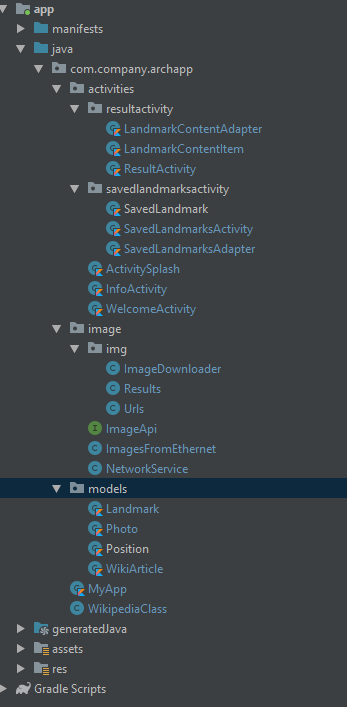

ViewIt by avt team
==================

# En version

## Structure of project files

### activities
Here's all activities classes. If for one activity necessary more the one class/file move to new package with the name of
activity

### models
Here's all models for realm database

### image
Here's all classes/files for getting images from ethernet using  retrofit

# Русская версия

## Структура файлов проекта

### activities
Здесь все файлы класов активностей. Если для одной активности нужно больше одного класса/файла перемещаем в новый пакет
с именем активности

### models
Здесь все модели для базы данных реалм

### image
Здесь все классы/файлы для получения картинок с интернета используя ретрофит